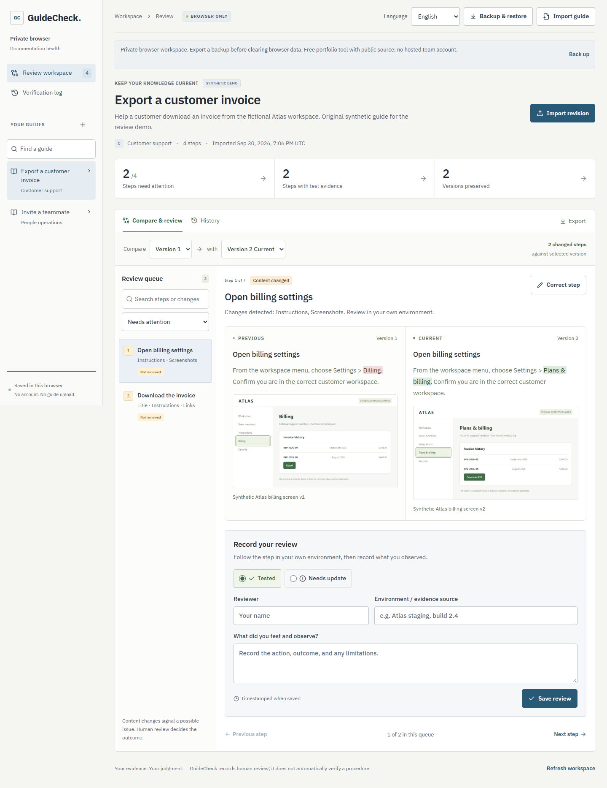

# GuideCheck

A private workspace for maintaining existing instructions. Import a guide, compare revisions, record what a reviewer actually tested, correct the document, and export the guide with its review history. No account or paid API is required. Changed content signals a potential issue; it never proves that a procedure works or fails.

[Open GuideCheck](https://seoshiro.github.io/guidecheck/) · [Source](https://github.com/seoshiro/guidecheck) · [Verification and deployment](https://github.com/seoshiro/guidecheck/actions/workflows/release.yml)



The public release is a free portfolio tool hosted as static files on GitHub Pages. Each browser profile keeps its own IndexedDB workspace. There is no shared writable server, login, or automatic synchronization. The optional local edition uses SQLite and preserves the same workflow. See the storage boundaries below before importing private documents.

Version 0.2 includes English, Russian and Kazakh interface languages, a self-hosted IBM Plex typeface, readable responsive controls and draft-preserving conflict recovery. Language changes preserve document/review content; exports keep stable English schema keys. Choose a language in the workspace or any dialog. The preference is saved only in this browser. Translation review is internal; professional native-language review remains an open validation task.

[Exploratory QA and control coverage](QA.md) records reproduced bugs and regressions. [Asset notices](THIRD_PARTY_NOTICES.md) document free sources, licenses and Kazakh glyph checks. History is paginated for large workspaces; complete exports retain all entries. A complete backup always reads the latest committed browser snapshot, including other tabs' saved work.

## Run locally

Requires Node.js 24.13+ (built-in `node:sqlite`) and pnpm. This workspace uses Node 24.19.0 and pnpm 11.19.0.

```powershell
pnpm install --frozen-lockfile --ignore-scripts
pnpm dev
# http://127.0.0.1:4381
```

For a production preview:

```powershell
pnpm build
pnpm start
```

The lockfile includes platform-specific optional binaries; keep optional dependencies enabled. This verified install skips dependency lifecycle scripts without changing global security settings. The server binds only to `127.0.0.1`. `PORT` overrides 4381; do not select a port used by another local project. Preview uses 4381; isolated tests use 4391–4394.

To preview the static/browser architecture, run `pnpm build:browser`, then `pnpm preview:browser` and open `http://127.0.0.1:4394/guidecheck/`. The browser build defaults to `/guidecheck/`; `VITE_BASE_PATH` can override the path for another host. In PowerShell, set an override with `$env:VITE_BASE_PATH = '/guidecheck/'`. This build writes `dist-browser/`; the SQLite build writes `dist/`.

## Try the complete workflow

1. Open the seeded **Export a customer invoice** guide. It is a fictional Atlas workflow with two versions and clearly labelled synthetic review evidence. Two changed steps need a fresh review; unchanged steps show carried evidence with the original timestamp.
2. Compare the previous and current instructions, links, and screenshots. Search the step queue or filter by review status.
3. Follow the procedure in an actual environment. Choose **Tested** or **Needs update**, then enter your name, environment/evidence source, and observations. GuideCheck records this human statement; it does not run or verify the procedure.
4. Use **Correct step** to edit instructions, references, screenshots, ownership, or guide context. Save with a version note. You can also import a complete revised Markdown or JSON guide.
5. Use **Export** for the selected guide version as Markdown/JSON, or download the verification history as JSON. **History** retains old versions and every review entry.
6. Open **Backup & restore** and download the complete workspace backup. Restore it in another browser/device to move all guides, screenshots, versions and reviews. Restore previews the backup and requires an explicit replacement confirmation. Reload or restart the browser to check normal persistence; keep backups for recovery.

Use **Import guide** to start with your own document. The dialog checks the import before saving. Downloadable example files are also provided in the dialog. The app has one review workspace and one verification log; controls use real stored data.

## Import formats

GuideCheck deliberately supports a documented subset, rather than silently guessing arbitrary documents. File extensions: `.md`, `.markdown`, `.json`. Maximum import: 5 MB, 100 steps, 20 references and 3 screenshots per step, 500 KB per screenshot. Guide titles, step titles, and stable IDs are required. Owner and description are optional. A revised guide must have a version note and differ from the current guide.

### Markdown

```markdown
# Invite a teammate

Owner: People operations

Context and prerequisites go here.

## Send an invitation
<!-- step:invite -->

Open Workspace settings > Members. Select Invite teammate.
[Reference](https://example.com/help/members)

## Confirm access
<!-- step:confirm -->

Ask the teammate to sign in and confirm they can view the workspace.
```

Use exactly one `# ` title and `## ` headings for steps. Retain explicit `<!-- step:stable-id -->` comments when importing revisions, especially when reordering. IDs use letters, numbers, underscores, or hyphens and must be unique. Without explicit IDs, steps receive `step-1`, `step-2`, etc. and match by position; that can produce incorrect correspondence after insertion/reorder. Markdown fenced sections containing `## ` headings are not supported; use structured JSON for that content. Instructions display as safe plain text, with separately extracted Markdown references and embedded images. This is not a rich Markdown renderer.

Links use `[Label](https://example.com/path)` without whitespace in the URL; balanced parentheses in destinations are supported. Screenshots use ``, or equivalent JPEG/WebP. Remote images, SVG, filesystem paths, credential-bearing URLs, and non-HTTP(S) references are rejected. Remote pages and links are never fetched. Exports retain step IDs. Exported reference metadata and a marked reference section keep separate JSON links out of instruction text on reimport. Edit the visible reference lines to revise links; clear the lines inside the section to remove them. Preserve the reserved GuideCheck markers. JSON is the lossless guide-content interchange format for arbitrary instruction text, including nested Markdown headings or literal embedded images.

### Structured JSON

```json
{
  "title": "Invite a teammate",
  "owner": "People operations",
  "description": "Check prerequisites before sending an invitation.",
  "steps": [
    {
      "id": "invite",
      "title": "Send an invitation",
      "text": "Open Workspace settings > Members.",
      "links": ["https://example.com/help/members"],
      "screenshots": []
    }
  ]
}
```

Each screenshot is `{ "name": "Screenshot description", "dataUrl": "data:image/png;base64,..." }`. Use `text` for instructions, not arbitrary HTML. Unknown fields are discarded. The verification report is an evidence export containing the full guide's versions and review history; it is not accepted as a guide import.

## How comparison and evidence work

- Stable step IDs match steps. Title, instructions, links, screenshot payload/name, and order changes are deterministic. Added and removed steps appear explicitly. A text word diff highlights additions/removals; large text falls back to showing entire changed blocks to bound memory use.
- Changes identify possible issues. A screenshot difference alone never proves a procedure succeeds or fails. GuideCheck does not check links, observe an external application, run steps, or use AI to generate verification claims.
- Reviews are append-only human statements for the current version. Each stores reviewer, outcome, note, environment/source, and timestamp. The browser edition uses the device clock; the local edition uses the server's device clock. Historical versions are read-only. Reviewer identity and clock are not independently verified.
- Evidence is carried only when the step is exactly unchanged, including its order, and guide context is unchanged. Its original timestamp and source version are preserved and displayed. It is not a new test. Any changed step returns to Not reviewed. Changing guide context invalidates all carried evidence; owner/title metadata changes alone do not.
- Removed steps remain in comparison/history but cannot receive a current-step review. The latest review determines the visible status; all earlier entries stay in history. No review expires automatically.
- Workspace revisions and base-version checks prevent stale writes from other tabs. Refresh before retrying a conflict. Unsubmitted form contents remain available after an error.

## Storage, privacy, and backup

**Public/browser edition.** Data stays in IndexedDB, in the distinctly named `guidecheck-private-workspace-v1` database. Transactions commit atomically and revisions reject stale writes from other tabs. The app never silently falls back to temporary storage. Clearing site data, private browsing, device loss, quota limits, or browser eviction can remove the workspace. It does not provide cloud backup or automatic cross-device synchronization. See [MDN's storage and eviction guidance](https://developer.mozilla.org/en-US/docs/Web/API/Storage_API/Storage_quotas_and_eviction_criteria).

Browser isolation is **per browser profile and origin**, not per repository URL. Other `https://seoshiro.github.io` sites share the same origin and could access its storage if their scripts deliberately do so. Namespaced databases avoid accidental collisions; they are not a security boundary. GuideCheck does not clear origin-wide storage and installs no service worker. For sensitive documents, use the loopback SQLite edition or host the static files on a dedicated trusted origin. Deployments preserve the same database name and schema; incompatible future migrations must be explicit.

**Local SQLite edition.** Data is stored in `data/guidecheck.sqlite` with WAL and atomic transactions. `GUIDECHECK_DB` selects an alternative database file. `GUIDECHECK_EMPTY=1` starts with no demo data **only for a new database**. Existing data is never overwritten or reseeded. Synthetic fixtures are original, not customer data or incumbent assets.

**Portable backup.** Complete backup JSON contains guides, embedded screenshots, versions, original review timestamps and carried evidence. It is unencrypted. Keep copies on storage you control. A restore replaces the current workspace atomically, preserving identities/history; it does not merge workspaces. Guide JSON/Markdown and verification reports have separate purposes and cannot replace a complete backup. Backups are bounded to 50 MB including the serialized envelope, with 100 guides, 200 versions per guide, and 20,000 review entries per guide. New writes that exceed those limits are rejected without changing existing data. Restore validates structural evidence consistency, but an editable backup is not a signed audit log or proof of reviewer identity.

Use the complete backup control in either edition. Stop the local server before copying the raw database as an additional manual backup. The app does not upload imports, screenshots, or review notes and uses no telemetry or remote fonts. Public hosting still receives normal page/asset requests; [GitHub records visitor IP addresses for security](https://docs.github.com/en/pages/getting-started-with-github-pages/what-is-github-pages). Opening a reference link is an explicit browser navigation. The static release has a restrictive CSP with `connect-src 'none'`; the local API rejects cross-origin requests and unexpected hosts. GitHub Pages cannot provide custom response headers here, so its CSP is delivered as HTML metadata and does not provide header-only frame restrictions.

This is a single-device product: no login, authorization between OS users, encrypted storage, collaborative sync, tamper-proof audit, recovery/import of verification reports, or cloud backup. Anyone with access to the browser profile or local app/database can act as a reviewer. Do not expose the SQLite server to a network. Import validators check payload size, URL schemes and basic image signatures; they are not a complete image decoder or malware scanner. Avoid putting secrets in guides. If existing SQLite data is corrupt or from a newer schema, startup fails instead of silently replacing it. Loading the app requires the hosted files; no offline-shell availability is promised.

## Free deployment

The workflow verifies the exact commit on standard `ubuntu-latest` runners, builds static files, and deploys only `dist-browser/`. It never publishes a SQLite database, local workspace, credentials, or test output. The HTML contains a `guidecheck-build` meta tag with the deployed commit SHA. Repository Pages must be configured with **GitHub Actions** as the build source.

[GitHub Pages](https://docs.github.com/en/pages/getting-started-with-github-pages/what-is-github-pages) is available for public repositories on GitHub Free. [Standard public-repository Actions runners are free](https://docs.github.com/en/billing/concepts/product-billing/github-actions). This workflow uses no paid API or hosted database, no larger runner, no dependency cache, and retains the small Pages artifact for one day. No billing activation is needed. Hosting remains subject to [Pages limits and usage rules](https://docs.github.com/en/pages/getting-started-with-github-pages/github-pages-limits), including the soft 100 GB/month bandwidth limit and prohibition on commercial SaaS hosting. This release is a portfolio tool; a commercial team service would need a different hosting and identity design. Limits and policies can change.

### Migration path

Schema v1 is a single transactional workspace record. Keep the typed domain and API boundary, then migrate to normalized guides/versions/steps/reviews tables in a numbered SQLite transaction when size/concurrency warrants it. Preserve IDs, original timestamps, carried-evidence references, and append-only reviews. Read `PRAGMA user_version`, back up first, and reject unsupported future versions. Remote collaboration would require a separate authorization/identity design and conflict model; no speculative service is configured here.

## Checks

```powershell
pnpm typecheck
pnpm lint
pnpm test
pnpm build
pnpm test:production
pnpm test:browser
pnpm build:browser
pnpm test:browser:public
pnpm format:check
```

Browser tests use installed Microsoft Edge locally and Playwright Chromium in CI (`CI=1`, `pnpm exec playwright install --with-deps chromium`). Set `VITE_BASE_PATH=/guidecheck/` for the public build/test pair. Tests use separate browser profiles/contexts and temporary SQLite files; only original synthetic fixtures are imported. Coverage includes malformed input, import/revision/review/correction/screenshot/export, backup and restore, actual process restarts, visitor separation, storage failure, responsive widths, keyboard dialogs, and automated WCAG A/AA checks. Automated checks are not a full screen-reader study or accessibility certification. Domain/API tests cover deterministic comparison, limits, evidence inheritance, stale writes, round trips, malformed backups and a near-limit backup. Set `GUIDECHECK_LIVE_URL` to test the public deployment with the same isolated golden path.

`node scripts/create-fixtures.mjs` regenerates the original fictional Atlas screenshots and downloadable import examples using an isolated browser and inline HTML. It does not capture any user application.

See [VALIDATION.md](VALIDATION.md) for actual check outcomes and limitations, and [RESEARCH.md](RESEARCH.md) for the product hypothesis. Code tests demonstrate implementation behavior, not customer demand or willingness to pay.
